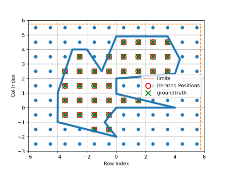
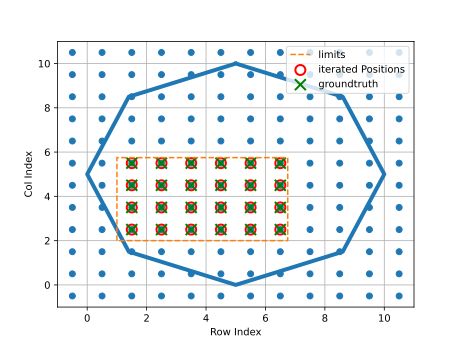

=========
Iterators
=========

These functions allow iterating efficiently over a given shape in a 2D array. On every cell lying in the
shape it calls a given functor. The functions iterate over
all cells whose center lies in the shape and calls the given functor with the cell indexes as arguments.
Three different shapes are available, namely rectangle, polygon and circle.

Examples
--------

Examples, can be seen in the figures:

   The figure shows a blue polygon which can be passed to the function iteratePolygon().
   The blue points mark the centers of all cells of the 2D map. The red circles mark
   the points over which the iterator iterated. A comparison with the green
   groundtruth markers shows that all selected points are correct, because they
   belong to cells whose center lies in the polygon.

   In addition to the polygon, the function iteratePolygon can be provided minimum and
   maximum x- and y-axis values. Then the function iterates only over cells whose center
   lies in the given shape and rectangle defined by the extreme values. In the figure,
   you can see that the function selects only the cells that lie in the polygon and the
   rectangle.

API
---

The iterator functions are overloaded. In total there are three versions each, differing
in how the minimum and maximum values are specified:

* no minimum and maximum specified
* minimum set to zero and maximum specified
* minimum and maximum specified

Iterate Circle
**************
.. doxygenfunction:: hector_math::iterateCircle( const Vector2<Scalar> &center, Scalar radius, Eigen::Index row_min,Eigen::Index row_max, Eigen::Index col_min, Eigen::Index col_max,Functor functor )
.. doxygenfunction:: hector_math::iterateCircle( const Vector2<Scalar> &center, Scalar radius, Eigen::Index rows, Eigen::Index cols, Functor functor )
.. doxygenfunction:: hector_math::iterateCircle( const Vector2<Scalar> &center, Scalar radius, Functor functor )

Iterate Rectangle
*****************
.. doxygenfunction:: hector_math::iterateRectangle( const Vector2<Scalar> &a, const Vector2<Scalar> &b, const Vector2<Scalar> &c,Eigen::Index row_min, Eigen::Index row_max, Eigen::Index col_min,Eigen::Index col_max, Functor functor )
.. doxygenfunction:: hector_math::iterateRectangle( const Vector2<Scalar> &a, const Vector2<Scalar> &b, const Vector2<Scalar> &c,Eigen::Index rows, Eigen::Index cols, Functor functor )
.. doxygenfunction:: hector_math::iterateRectangle( const Vector2<Scalar> &a, const Vector2<Scalar> &b, const Vector2<Scalar> &c, Functor functor )

Iterate Polygon
***************
.. doxygenfunction:: hector_math::iteratePolygon( const Polygon<Scalar> &polygon, Eigen::Index row_min, Eigen::Index row_max,Eigen::Index col_min, Eigen::Index col_max, Functor functor )
.. doxygenfunction:: hector_math::iteratePolygon( const Polygon<Scalar> &polygon, Eigen::Index rows, Eigen::Index cols, Functor functor )
.. doxygenfunction:: hector_math::iteratePolygon( const Polygon<Scalar> &polygon, Functor functor )

